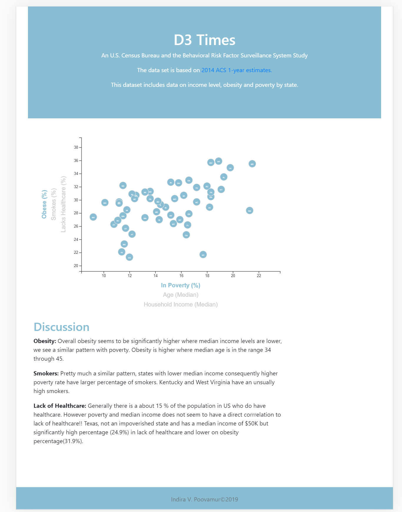

# Data Journalism and D3

## D3 Times

For this challenge analyzed [2014 ACS 1-year estimates](https://factfinder.census.gov/faces/nav/jsf/pages/searchresults.xhtml) from the U.S. Census Bureau and the Behavioral Risk Factor Surveillance System. 
Also created scatter plot with interactive elements to identify trends and tell stories about the health risks facing particular demographics. 

